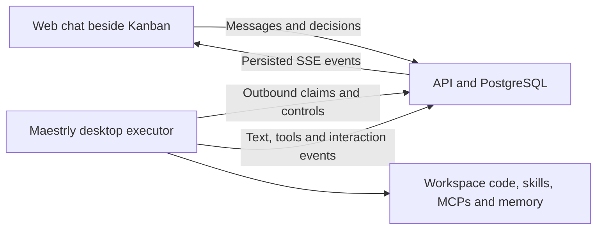

# Project chat connected to the Maestrly executor

## Outcome

The Kanban web app gains a persistent project chat beside the board. A person can discuss the code, inspect the full project board, search completed and archived cards, use enabled MCPs and skills, consult project memory, and request changes. Assistant text and tool progress arrive while the turn is running. Questions, tool permissions and plan decisions can be answered in the web app.

The initial visibility assumption is individual conversations within a project: the creator owns the history and controls execution. Project membership alone does not expose another person's conversation. This is a proposed default, not a user-confirmed preference.

## Existing building blocks and gaps

- `apps/desktop/src/main/platform/desktop-executor.ts` runs the normal chat engine with connected providers, selected skills and MCPs. Its current policy deliberately disables interaction and creates a new local conversation per card run.
- `apps/desktop/src/main/chat/service.ts` already has persisted multi-turn conversations, text/tool events, permissions, questions, cancellation and plan continuations. Live subscriptions currently target Electron WebContents.
- `apps/web/src/features/automations/ExecutionConversation.tsx` polls a limited execution transcript every two seconds. It is an execution viewer, not an interactive chat.
- `apps/desktop/src/main/mcp/tools/board.ts` uses the local operator's platform token and workspace binding. Remote project chats require their own delegated authority and project-wide queries.
- Project memory is indexed by the desktop workspace; instructions and skills have local/project sources. These remain executor capabilities, not new server-side copies.

## Chosen architecture

Use the installed Maestrly desktop as an interactive runner. The web talks only to the platform API; the executor makes outbound authenticated connections. No tunnel, inbound desktop HTTP listener, provider key in the browser, or Electron dependency in web/server packages is needed.

Two alternatives were considered: a headless implementation would need to reproduce desktop memory, skills, MCP and interactive broker integration; hosting the engine on the server would require moving repository access and provider configuration there. Both are larger independent changes. This delivery supports desktop executors that advertise `chat:interactive:v1`; existing CLI runners keep their current card-job behavior.

A chat is not a card job. It has an optional board/card context, independent turns, and a stable executor binding. Sending or finishing a message does not move cards. Explicit board changes still use optimistic concurrency, idempotency and normal domain events.

## Identity, execution and local context

New sessions select a project, an eligible executor, an opaque workspace binding, an advertised model and optional board/card context. Personal devices are selectable only by their owner. Team executors must explicitly enable interactive chat for their configured projects. The requester needs `execution:request`; a viewer cannot start a turn. Reads also require session ownership and current project access.

Pin executor/workspace identity for a conversation. Allocate one durable local conversation and worktree using `workspace-service.createConversation`, with a server-session-derived branch and the chosen committed base. Reuse that worktree and provider session for subsequent messages. Keep the original workspace ID for memory and project configuration. Display repository/base branch context so the user knows which code is being discussed. The original checkout and its uncommitted work are not silently moved or reset. Missing local worktrees or session mappings produce a recovery error; never silently restart the conversation elsewhere.

Use a new interactive host adapter, not `AUTONOMOUS_INSTRUCTIONS` or `executor_report`. Saved executor settings remain an upper bound on providers/tools. Interactive requests within that boundary use existing brokers. A web decision cannot enable a tool disabled by the operator or save a global permission on the operator's machine; permissions initially offer allow once or reject. Read-only/chat versus agent mode must be enforced across all supported provider paths.

Web-managed local conversations remain inspectable in desktop. Local send/edit/retry/plan actions must enter the same server-authoritative command path or be rejected with a clear managed-session message; they must never create a second untracked writer. Closing a window or web drawer does not stop generation when background execution is enabled. Pause, quit, revocation and explicit stop cancel the real turn and its delegates.

## Persistence and ordering

Add migration `008_project_chat.sql` for sessions, turns, messages, stream events, interactions and scoped turn tokens. Use UUID identifiers, `timestamptz` timestamps, constrained states, composite tenant/project foreign keys and indexes for owner history, executor queues and `(session_id, sequence)`. Enable and force RLS. Session ownership and assigned-runner access supplement tenant isolation; chat bodies never enter the project-wide domain event feed.

At most one nonterminal turn per conversation. A message submission atomically persists its client message ID and enqueues a turn. Duplicate requests return the same turn. Enqueue while busy returns a conflict without losing the draft. Turn states are `queued`, `running`, `waiting_input`, `cancelling`, `succeeded`, `failed`, `cancelled`, `interrupted`. A staged plan ends its generating turn and leaves a versioned pending interaction; approval or revision atomically creates the next turn.

Claims lock the runner and use `FOR UPDATE SKIP LOCKED`. Card runs and chat turns share the existing concurrency budget. Idle conversations do not reserve capacity. Lease duration is 60 seconds with renewal every 15 seconds; controls continue to be fetched during a running or waiting turn. Recheck binding, role, owner, enabled state and model availability on admission and renewal.

The executor journals command admission, local conversation identity and outbound events. Text is coalesced into batches over at most 100 ms. Events have stable producer IDs and per-session committed sequence numbers; an acknowledgement is sent only after durable persistence. Repeated uploads are deduplicated; final snapshots reconcile message content and tool state. Bounded buffers apply backpressure, never silently drop text. A lost lease stops execution and fences later uploads. After a process crash, uncertain work becomes interrupted and is retried only explicitly; do not claim exactly-once external tool effects.

## Realtime protocol

Define a browser-safe `project-chat` protocol in `packages/protocol` and transport/reducer utilities in `packages/client-sdk`. Do not import `apps/desktop/src/shared/chat.ts` into other apps.

Project routes expose eligible destinations and owned sessions. Session routes expose paginated messages, current turn/pending interactions, message submission, cancellation, versioned decisions, archive and an SSE feed. Runner routes expose chat capability publication, claim, lease/control polling, event batches and completion. Reuse current machine authentication and validate the exact session, turn and lease on every runner request.

SSE uses persisted sequence IDs and `Last-Event-ID`/cursor replay. Initial hydration returns the message snapshot and its matching event cursor from one transaction. Reconnect replays only subsequent events. Membership/session authorization is rechecked on stream reads. Support keepalive, client backpressure and proxy buffering disabled. Target p95 under 500 ms from desktop event emission to browser rendering in the local integration fixture; model response latency is measured separately. The browser never polls full transcripts every two seconds for this feature.

Public events cover message/part start, text deltas, tool progress and bounded inspected results, public reasoning summaries when supplied by the provider, completion, interruption, pending permissions/questions and versioned plans. Exclude internal system/developer messages, credentials, provider session files and unrelated local history. Apply an explicit projection, size limits and redaction before upload. This filtering does not imply arbitrary model text can never contain sensitive project content.

## Project tools

Issue a short-lived token tied to requester, organization, project, session, turn, executor and lease. Remote conversations must never fall back to the desktop operator's broad human token. Derive the audit actor from the stored requester, using the existing `desktop_agent` shape with the server session ID and additional turn attribution in audit metadata.

Offer project/board listing, paginated card listing/search, card detail with comments/subtasks/history, and existing card creation/update/comment/move actions. Search covers active cards, done-column cards and archived cards as explicit distinct filters. Deleted cards remain excluded. Start with PostgreSQL full-text search using `simple` configuration over title and description, an exact-ID path and stable cursor pagination; return snippets and resource IDs for clickable source references. A zero-result search is distinct from an unavailable tool or disconnected executor.

Mutations reauthorize the requester and enforce expected versions and request IDs. They do not enable automation chaining by default. Native memory and skill tools retain their established workspace scope. Publish availability/counts for skills/MCPs/memory and their configured restrictions so an unavailable integration is visible; do not silently claim that all integrations are connected.

## Web experience

Add a project-scoped Chat control opening a right-hand drawer; allow an expanded view. On narrow screens use a full-width panel. Preserve the visual tokens, sidebar geometry, keyboard focus, PT-BR/English translations and reduced-motion behavior.

Include new conversation/history, executor and model selection, repository/base context, board/card context chips, a multiline composer, streaming Markdown/code, expandable tool cards, pending questions/permissions/plans, stop/retry, and online/queued/reconnecting/interrupted states. Drafts are keyed by project/session; switching projects cannot reuse the previous conversation or context. Follow output only while the user remains near the bottom and offer a new-messages affordance otherwise. Links to cards, including done/archived cards, open the existing card details.

Offline conversations stay readable. An explicitly targeted offline executor may retain a queued turn, shown as waiting for that machine; never reroute it automatically. New features are capability-gated so an old installed desktop is shown as requiring an update, rather than accepting a conversation it cannot run.

## Verification and delivery

- Server integration: tenant and same-project owner isolation; shared SSE contains no private chat data; delegated requester authority; duplicate message/event/decision handling; simultaneous claims and cross-job capacity; stale leases; revocation; cursor replay and stable search pagination.
- Desktop: events without a mounted ChatView; two turns share one worktree/provider context; code + memory + skills + MCP availability; user-scoped board tools; permission/question/plan round trips; cancellation and delegate cleanup; recovery with lost upload acknowledgements; unchanged unattended executor behavior.
- Real Electron + API + Chromium fixture: a deterministic model reads a known source file, retrieves a seeded project memory, invokes a fixture MCP, searches a completed card, streams chunks before completion, answers a follow-up, and waits for a permission and a plan decision made in the web. Reconnect the browser mid-turn and verify no missing/duplicated text. No paid provider call is required for the fixture.
- Web E2E: drawer, context switching, history, disconnected state, cancel/retry, i18n, focus and mobile overflow. Inspect actual browser screenshots at 390 and 1440 px in both themes, including a long answer, tool result and pending interaction.
- Run focused checks per change, then `npm run check`, lint, docs, policy, integration and the existing real Kanban/desktop suites. Commit coherent changes using conventional subjects.
- Build API, web and the updated desktop executor together. Roll out the additive migration and API before web; verify an updated executor against that API. The earlier web-only deploy procedure is insufficient for this feature. Any deployment uses the already-authorized environment and its recorded procedure, with versioned images and rollback; do not publish a new public desktop release as an implied part of this request.
